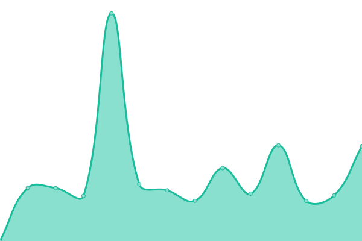

# [📈 Live Status](https://upptime.github.io/upptime): <!--live status--> **🟥 Complete outage**

This repository contains the open-source uptime monitor and status page for [Upptime](https://upptime.js.org), powered by [Upptime](https://github.com/upptime/upptime).

With [Upptime](https://upptime.js.org), you can get your own unlimited and free uptime monitor and status page, powered entirely by a GitHub repository. We use [Issues](https://github.com/upptime/upptime/issues) as incident reports, [Actions](https://github.com/Phaf4IT/upptime-studentenkerk/actions) as uptime monitors, and [Pages](https://upptime.github.io/upptime) for the status page.

<!--start: status pages-->
<!-- This summary is generated by Upptime (https://github.com/upptime/upptime) -->
<!-- Do not edit this manually, your changes will be overwritten -->
<!-- prettier-ignore -->
| URL | Status | History | Response Time | Uptime |
| --- | ------ | ------- | ------------- | ------ |
|  [Studentenkerk](https://www.studentenkerk.nl) | 🟥 Down | [studentenkerk.yml](https://github.com/Phaf4IT/upptime-studentenkerk/commits/HEAD/history/studentenkerk.yml) | 

 1275ms
     
 | 

<a href="https://Phaf4IT.github.io/upptime-studentenkerk/history/studentenkerk">38.36%</a>
    

|  [Alpha-Cursus voor Young Professionals](https://young-professional.alphautrecht.nl/) | 🟥 Down | [alpha-cursus-voor-young-professionals.yml](https://github.com/Phaf4IT/upptime-studentenkerk/commits/HEAD/history/alpha-cursus-voor-young-professionals.yml) | 

 1470ms
     
 | 

<a href="https://Phaf4IT.github.io/upptime-studentenkerk/history/alpha-cursus-voor-young-professionals">37.65%</a>
    

|  [Business Alpha-Cursus](http://businessalphautrecht.nl/) | 🟥 Down | [business-alpha-cursus.yml](https://github.com/Phaf4IT/upptime-studentenkerk/commits/HEAD/history/business-alpha-cursus.yml) | 

 1532ms
     
 | 

<a href="https://Phaf4IT.github.io/upptime-studentenkerk/history/business-alpha-cursus">41.10%</a>
    

<!--end: status pages-->

[**Visit our status website →**](https://upptime.github.io/upptime)

## 📄 License

- Powered by: [Upptime](https://github.com/upptime/upptime)
- Code: [MIT](./LICENSE) © [Anand Chowdhary](https://anandchowdhary.com), supported by [Pabio](https://pabio.com)
- Data in the `./history` directory: [Open Database License](https://opendatacommons.org/licenses/odbl/1-0/)
